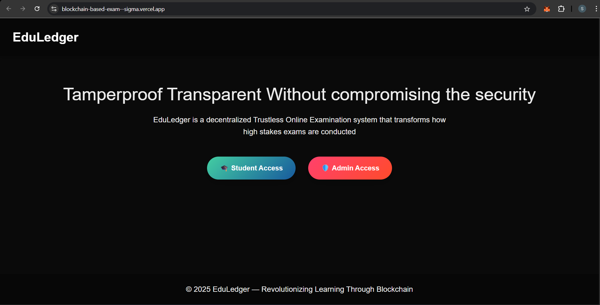

# EduLedger – Blockchain-based Exam Platform

EduLedger is a decentralized exam platform that leverages blockchain technology to provide secure, transparent, and voice-enabled online examinations. Built with Next.js, Thirdweb, and Pinata, EduLedger ensures a seamless exam experience for students while offering robust administrative control for exam creators and center administrators.

## Key Features

### 🎓 Student Role

- View all available exams.
- Access exams and submit answers.
- Voice-enabled responses (e.g., saying "OPTION A" selects Option A).
- Real-time proctoring with tab-switch detection and flagging.
- View results if the exam is completed.

### 🛠️ Admin Role

- Create and upload exams as screenshots.
- Automatic question extraction from screenshots with edit capability.
- View all created exams.

### 🏫 Centre Admin Role

- View all student submissions.
- Disable or enable exams as needed.
- Monitor exam integrity.

## Tech Stack

- **Frontend:** Next.js (React framework)
- **Blockchain:** Thirdweb (smart contract deployment)
- **Storage:** Pinata (IPFS for questions and results)
- **Voice Commands:** Speech Recognition API
- **Proctoring:** Tab activity monitoring

## Installation and Setup

1. **Clone the Repository**

   ```bash
   git clone https://github.com/call-me-suman/BlockchainBasedExam.git
   cd BlockchainBasedExam
   ```

2. **Install Dependencies**

   ```bash
   npm install
   ```

3. **Configure Environment Variables**

   - Set up your Thirdweb and Pinata API keys in the `.env` file.
   - Example:

   ```env
   NEXT_PUBLIC_THIRDWEB_CLIENT_ID=your_thirdweb_clientId
   NEXT_PUBLIC_THIRDWEB_ADDRESS=your_thirdweb_address
   PINATA_API_KEY=your_pinata_api_key
   PINATA_SECRET_API_KEY=your_pinata_secret_api_key
   ```

4. **Run the Application**

   ```bash
   npm run dev
   ```

5. **Deploy Smart Contracts**

   - Deploy your smart contracts using Thirdweb.

6. **Access the Application**

   - Open your browser and navigate to `http://localhost:3000`

## Screenshots



## Contributing

Feel free to submit issues, fork the repository, and make pull requests. For significant changes, please open an issue first to discuss what you would like to change.

## License

This project is licensed under the MIT License.

## Contact

For any queries, reach out to [Suman](mailto:sumank366929@gmail.com).
